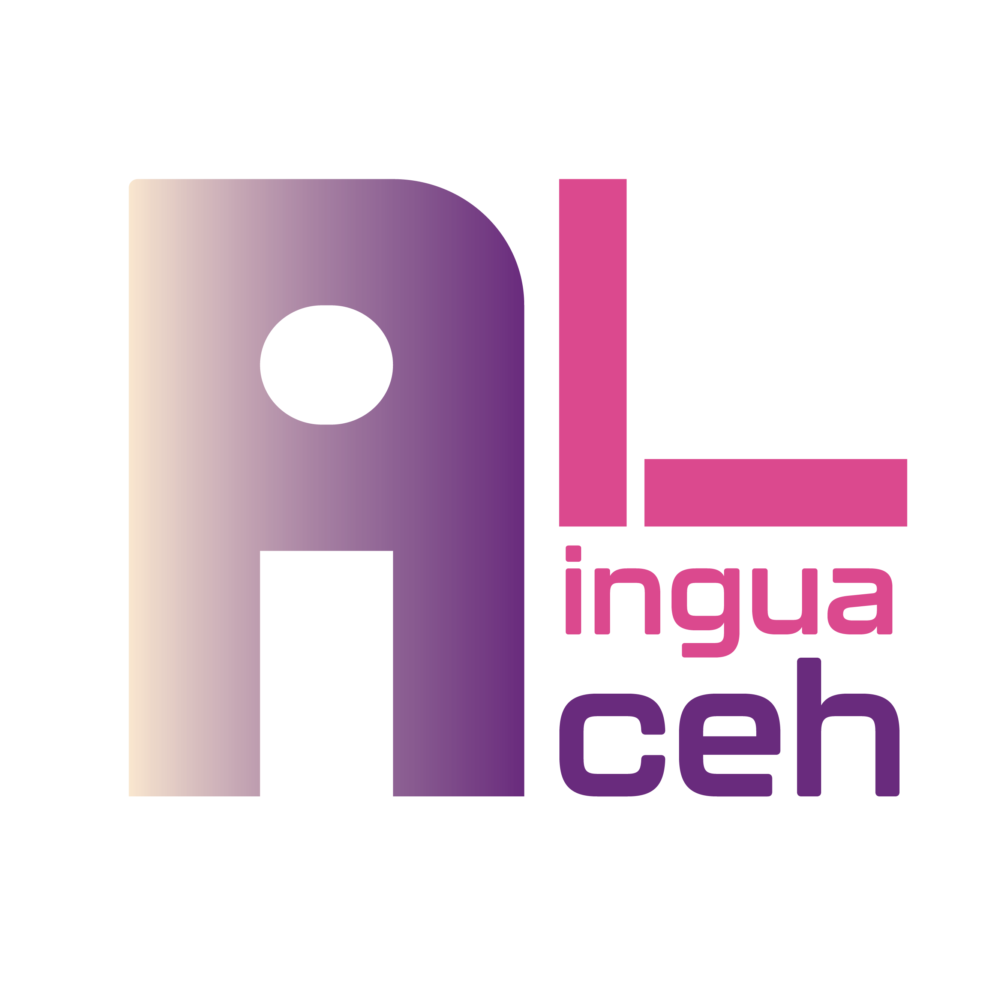

#  Penerapan Model T5 untuk Penerjemahan Mesin Aceh-Indonesia - kelompok 7

Kelompok 7 

Ivander Perdana Mokhtar 

Aulia Wardani  

Hanna Sajidah  

M. Faqih  

Berliyana Kesuma Hati 

#  Apa itu Aceh Lingua ?

Aceh Lingua adalah sebuah website penerjemah bahasa Aceh ke bahasa Indonesia dengan model Transformer T5. Website ini dirancang untuk memudahkan proses penerjemahan secara cepat dan akurat, mendukung kebutuhan komunikasi lintas bahasa untuk pelestarian budaya dan bahasa lokal.
 

  
